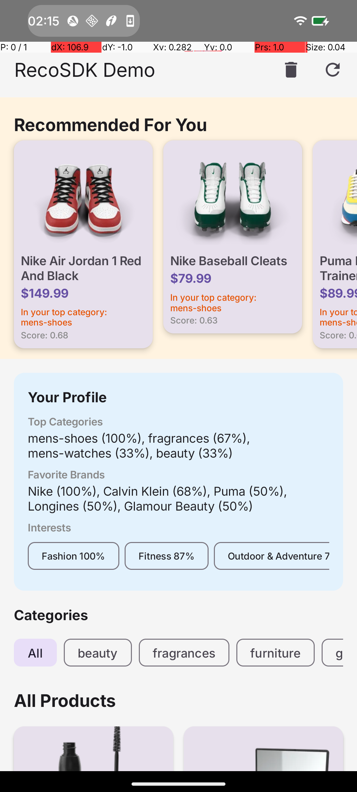

# RecoSDK — On-Device Recommendation Engine for Android

An on-device, ML-powered recommendation engine packaged as a reusable Android SDK. No server calls, no cloud dependencies — recommendations are computed locally using behavior scoring, text classification, collaborative filtering, and optional TFLite semantic embeddings.

<p align="center">
  
</p>

## Quick Start

### 1. Add Dependencies

```kotlin
// settings.gradle.kts
include(":recsdk")
include(":recsdk-tflite")  // optional

// app/build.gradle.kts
dependencies {
    implementation(project(":recsdk"))
    implementation(project(":recsdk-tflite"))  // optional: adds semantic embeddings
}
```

### 2. Initialize

```kotlin
// Without TFLite — uses built-in TF-IDF (zero extra dependencies)
class MyApp : Application() {
    override fun onCreate() {
        super.onCreate()
        RecoEngine.init(context = this, config = RecoConfig())
    }
}
```

```kotlin
// With TFLite — semantic embeddings that understand meaning
class MyApp : Application() {
    private var provider: TfLiteEmbeddingProvider? = null

    override fun onCreate() {
        super.onCreate()
        provider = TfLiteEmbeddingProvider(this)
        RecoEngine.init(
            context = this,
            config = RecoConfig(embeddingProvider = provider)
        )
    }

    override fun onTerminate() {
        super.onTerminate()
        provider?.close()  // release native resources
    }
}
```

### 3. Feed Products

Map your product data to `RecoItem`:

```kotlin
val items = products.map { product ->
    RecoItem(
        id = product.id.toString(),
        title = product.title,
        description = product.description,
        category = product.category,
        brand = product.brand,
        price = product.price,
        imageUrl = product.thumbnail,
        tags = product.tags
    )
}
RecoEngine.feedItems(items)
```

### 4. Track Events

```kotlin
// Track user interactions
RecoEngine.trackEvent(EventType.VIEW, productId)
RecoEngine.trackEvent(EventType.CLICK, productId)
RecoEngine.trackEvent(EventType.ADD_TO_CART, productId)
RecoEngine.trackEvent(EventType.PURCHASE, productId)
RecoEngine.trackEvent(EventType.FAVORITE, productId)
```

### 5. Get Recommendations

```kotlin
// From a coroutine
val result: RecoResult = RecoEngine.getRecommendations(limit = 20)
result.items.forEach { scored ->
    println("${scored.item.title} — score: ${scored.score}")
    println("  reasons: ${scored.reasons}")
}

// From non-coroutine code
RecoEngine.getRecommendationsAsync(limit = 20) { result ->
    // runs on main thread
}
```

## Configuration

```kotlin
RecoConfig(
    maxRecommendations = 20,           // max items returned
    recencyHalfLifeDays = 7,           // event weight halving period
    profileRebuildIntervalMs = 300_000L, // profile cache TTL (5 min)
    enableTextClassification = true,    // keyword-based tag classification
    eventRetentionDays = 90,           // auto-prune old events
    enableDebugLogging = false,
    enableCoOccurrence = true,          // item-item collaborative filtering
    enableSemanticSimilarity = true,    // TF-IDF or TFLite similarity
    embeddingProvider = null,           // null = TF-IDF, set = TFLite
    coOccurrenceTimeWindowHours = 24    // session grouping window
)
```

## Architecture Deep Dive

### Scoring Pipeline

Every recommendation request flows through a weighted multi-strategy ranker:

```
User Events → Profile Builder → Scoring Strategies → Weighted Sum → Ranked Results
                                      │
                     ┌────────────────┼────────────────┐
                     │                │                 │
              Rule-Based (50%)   Co-Occurrence (25%)  Semantic (25%)
              ├─ Category 0.20   └─ Item-item pairs   └─ TF-IDF or TFLite
              ├─ Brand    0.15                             cosine similarity
              └─ Tag      0.15
```

Weights redistribute automatically when engines are disabled:
- All engines enabled: `[0.20, 0.15, 0.15, 0.25, 0.25]`
- Only co-occurrence: `[0.30, 0.20, 0.20, 0.30]`
- Only semantic: `[0.30, 0.20, 0.20, 0.30]`
- No ML engines: `[0.35, 0.30, 0.35]`

### Event Weighting

| EventType | Weight | Example |
|---|---|---|
| VIEW | 1.0 | Product appeared in feed |
| SEARCH | 1.5 | User searched for a term |
| CLICK | 2.0 | Opened product detail |
| ADD_TO_CART | 4.0 | Added to shopping cart |
| FAVORITE | 5.0 | Saved / wishlisted |
| PURCHASE | 8.0 | Completed purchase |

Weights decay exponentially: `weight * 2^(-daysSinceEvent / halfLifeDays)`

### SimilarityEngine — The Abstraction Layer

Both TF-IDF and TFLite embeddings implement the same internal interface:

```kotlin
internal interface SimilarityEngine {
    suspend fun buildAndStore(items: List<RecoItem>)
    fun prepareUserEmbedding(events: List<EventEntity>)
    fun getCachedSimilarity(itemId: String): Double
    suspend fun loadPersistedEmbeddings()
    suspend fun clearAll()
}
```

**TfIdfEngine** — Tokenizes product text, computes term frequency / inverse document frequency, stores as `SparseVector` (Map<Int, Double>). Zero external dependencies. Good for exact keyword matching scenarios.

**EmbeddingBridge** — Wraps a public `EmbeddingProvider`, calls `embedText()` to produce `DenseVector` (FloatArray), stores as JSON in Room. Handles user embedding computation as a weighted average of interacted item vectors. Provides cosine similarity scoring.

`SemanticSimilarityScorer` accepts either implementation and doesn't know which one it's using.

### EmbeddingProvider — The Public Integration Point

```kotlin
interface EmbeddingProvider {
    fun embedText(text: String): FloatArray
    fun dimensions(): Int
}
```

This is the **only** public interface the external `recsdk-tflite` module implements. All internal types (`EmbeddingDao`, `EventEntity`, `ScoringStrategy`, `TimeProvider`) remain `internal` to `recsdk`. The bridge pattern keeps the module boundary clean:

```
External module                    Core SDK (internal)
┌─────────────────┐               ┌──────────────────────┐
│ TfLiteEmbedding │  FloatArray   │ EmbeddingBridge      │
│   Provider      │ ────────────> │  ├─ stores to Room   │
│                 │               │  ├─ computes user emb│
│ implements      │               │  └─ caches similarity│
│ EmbeddingProvider│              │                      │
└─────────────────┘               │ implements           │
                                  │ SimilarityEngine     │
                                  └──────────────────────┘
```

### EmbeddingBridge — Internal Wiring

The bridge handles the full lifecycle:

1. **`buildAndStore(items)`** — For each item, concatenates title + description + category + brand + tags, calls `provider.embedText()`, wraps result in `DenseVector`, persists JSON to `EmbeddingEntity` via Room.

2. **`prepareUserEmbedding(events)`** — Computes a weighted average of all item vectors the user has interacted with. Each event's item vector is scaled by `eventWeight` (VIEW=1.0, PURCHASE=8.0). The result is normalized by total weight.

3. **`getCachedSimilarity(itemId)`** — Returns cosine similarity between the cached user embedding and the requested item's embedding. Called once per candidate item during the scoring loop.

4. **`loadPersistedEmbeddings()`** — Restores item embeddings from Room on app restart.

5. **`clearAll()`** — Wipes embeddings for GDPR/logout.

### TfLiteEmbeddingProvider — MediaPipe Integration

```kotlin
class TfLiteEmbeddingProvider(
    context: Context,
    modelPath: String = "universal_sentence_encoder.tflite"
) : EmbeddingProvider
```

- Uses **MediaPipe TextEmbedder** with the Universal Sentence Encoder model
- Auto-detects model dimensions at init via a probe embedding (no hardcoded values)
- Truncates input to 512 characters to stay within model limits
- Returns zero vector for blank input
- Call `close()` when done to release native TFLite resources

### SemanticClassifier — Embedding-Based Tags

```kotlin
class SemanticClassifier(
    provider: EmbeddingProvider,
    threshold: Double = 0.3
) : ItemClassifier
```

Replaces keyword matching with semantic similarity:

1. Pre-computes embeddings for 17 category descriptions (lazily, on first use)
2. For each product, embeds the combined text (title + description + tags)
3. Computes cosine similarity against every category embedding
4. Returns all categories exceeding the threshold as `Map<String, Double>`

Categories: Vegan, Vegetarian, Non-Vegetarian, Organic, Gluten-Free, Healthy, Premium, Budget, Spicy, Sweet, Beverage, Snack, Breakfast, Baby, Pet, Household, Personal Care.

### DenseVector vs SparseVector

| | DenseVector | SparseVector |
|---|---|---|
| Storage | `FloatArray` | `Map<Int, Double>` |
| Used by | EmbeddingBridge (TFLite) | TfIdfEngine |
| Dimensions | Model-dependent (e.g., 100) | Vocabulary size |
| Memory | Fixed per dimension | Proportional to non-zero terms |
| Serialization | JSON float array | JSON map |
| Similarity | Cosine via dot product | Cosine via sparse dot |

### Co-Occurrence Engine

Builds an item-item affinity matrix from user event history:

1. Groups events within a time window (default: 24 hours)
2. Creates pairs from all items in each session
3. Weights each pair by `eventA.weight * eventB.weight`
4. Stores co-occurrence counts in Room (`CoOccurrenceEntity`)
5. At scoring time, boosts items that frequently co-occur with recently interacted items

### Room Database Schema

| Entity | Key Fields | Purpose |
|---|---|---|
| `EventEntity` | itemId, eventType, weight, timestamp | User interaction history |
| `EmbeddingEntity` | itemId, vectorJson, updatedAt | TF-IDF or dense embeddings |
| `CoOccurrenceEntity` | itemIdA, itemIdB, score | Item pair affinity scores |
| `ItemCacheEntity` | itemId, title, category, brand, ... | Cached product catalog |
| `ProfileEntity` | profileJson, updatedAt | Serialized user profile |

## Custom Embedding Provider

Implement `EmbeddingProvider` to plug in any embedding model:

```kotlin
class MyCustomProvider : EmbeddingProvider {
    override fun embedText(text: String): FloatArray {
        // Your model inference here
        return myModel.encode(text)
    }

    override fun dimensions(): Int = 256
}

// Use it
RecoEngine.init(context, RecoConfig(
    embeddingProvider = MyCustomProvider()
))
```

## Custom Classifier

Implement `ItemClassifier` to replace keyword-based classification:

```kotlin
class MyClassifier : ItemClassifier {
    override fun classify(
        title: String,
        description: String,
        tags: List<String>
    ): Map<String, Double> {
        // Return tag name -> confidence score
        return mapOf("Electronics" to 0.9, "Premium" to 0.7)
    }
}

// Use it
RecoEngine.init(context, config, classifier = MyClassifier())
```

Or use the TFLite-powered semantic classifier:

```kotlin
val provider = TfLiteEmbeddingProvider(context)
val classifier = SemanticClassifier(provider)
RecoEngine.init(context, config, classifier = classifier)
```

## Testing

```bash
# Run all SDK tests (101 tests across 10 suites)
./gradlew :recsdk:test

# Build all modules
./gradlew :recsdk:assembleDebug :recsdk-tflite:assembleDebug :demo:assembleDebug
```

| Test Suite | Tests | What it covers |
|---|---|---|
| DenseVectorTest | 17 | Dot product, cosine similarity, JSON serialization, dimension mismatch handling |
| SparseVectorTest | 14 | Sparse vector operations, cosine similarity |
| EmbeddingBridgeTest | 8 | Provider wrapping, user embedding, persistence, clearing |
| CoOccurrenceEngineTest | 9 | Session grouping, pair weighting, matrix rebuild |
| TfIdfEngineTest | 10 | Tokenization, TF-IDF computation, similarity ordering |
| SemanticSimilarityScorerTest | 5 | Score delegation, zero-score items, reason generation |
| CoOccurrenceScorerTest | 5 | Co-occurrence score integration |
| KeywordClassifierTest | 12 | 16-category keyword matching, multi-tag classification |
| BehaviorScorerTest | 11 | Event weighting, recency decay, weight aggregation |
| RecommendationRankerTest | 10 | Multi-strategy weighted ranking, limit, deduplication |

All tests are pure JVM unit tests — no Android instrumentation needed. ML tests use fake DAOs and fake embedding providers.

## API Reference

### RecoEngine

| Method | Description |
|---|---|
| `init(context, config, classifier)` | Initialize SDK (call once in Application.onCreate) |
| `feedItems(items: List<RecoItem>)` | Feed product catalog |
| `trackEvent(eventType, itemId)` | Track user interaction |
| `getRecommendations(limit): RecoResult` | Get ranked recommendations (suspend) |
| `getRecommendationsAsync(limit, callback)` | Non-suspend version |
| `getUserProfile(): UserProfile` | Get current user profile (suspend) |
| `clearUserData()` | Wipe all stored data (GDPR) |
| `shutdown()` | Release resources |

### RecoItem

| Field | Type | Default | Description |
|---|---|---|---|
| `id` | String | required | Unique product identifier |
| `title` | String | required | Product name |
| `description` | String | "" | Product description |
| `category` | String | "" | Product category |
| `brand` | String | "" | Brand name |
| `price` | Double | 0.0 | Product price |
| `imageUrl` | String | "" | Product image URL |
| `tags` | List<String> | [] | Product tags |
| `metadata` | Map<String, String> | {} | Custom key-value pairs |

## Requirements

- Android SDK 24+ (Android 7.0)
- Kotlin 1.9+
- Java 17

## License

MIT
